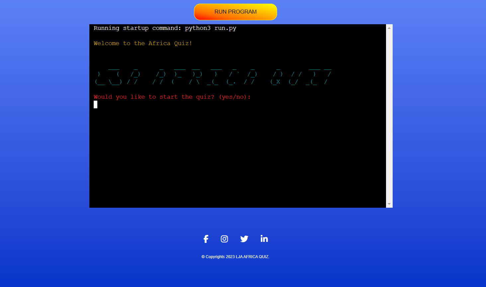

# LJA Africa Quiz 

**Developer: [Lanre James Andero]**

💻 [Visit live website](https://lja-africa-quiz-94254bc80955.herokuapp.com/)

## About

Welcome to the LJA Africa Quiz! Test your knowledge about Africa with this engaging and educational quiz game. Answer questions about geography, history, culture, and more to prove your expertise on the diverse continent.

## Table of Contents
  - [Project Goals](#project-goals)
    - [User Goals](#user-goals)
    - [Site Owner Goals](#site-owner-goals)
  - [User Experience](#user-experience)
    - [Target Audience](#target-audience)
    - [User Requirements and Expectations](#user-requirements-and-expectations)
    - [User Manual](#user-manual)
  - [User Stories](#user-stories)
    - [Users](#users)
    - [Site Owner](#site-owner)
  - [Technical Design](#technical-design)
    - [Flowchart](#flowchart)
  - [Technologies Used](#technologies-used)
    - [Languages](#languages)
    - [Frameworks & Tools](#frameworks--tools)
    - [Libraries](#libraries)
  - [Features](#features)
  - [Validation](#validation)
  - [Testing](#testing)
    - [Manual Testing](#manual-testing)
    - [Automated Testing](#automated-testing)
  - [Bugs](#bugs)
  - [Deployment](#deployment)
  - [Credits](#credits)
  - [Acknowledgements](#acknowledgements)

## Project Goals

### User Goals

- Learn and have fun while testing knowledge about Africa.
- Engage in an interactive quiz game.
- Compete with other players to achieve high scores.

### Site Owner Goals

- Develop an educational and entertaining quiz platform.
- Provide a seamless and enjoyable user experience.
- Encourage users to explore and learn more about Africa.

## User Experience

### Target Audience

The quiz is suitable for anyone interested in testing and expanding their knowledge of Africa. Recommended for players aged 12 and above.

### User Requirements and Expectations

- Access to an easy-to-navigate quiz platform.
- Clear instructions on how to play the game.
- Immediate feedback on quiz performance.
- Engaging questions covering various aspects of Africa.

### User Manual

Click here to view instructions

#### Main Menu
Upon entering the quiz, users will encounter the main menu featuring the LJA Africa Quiz logo. The menu offers several options:
1. Start Quiz
2. Complete Quiz
3. View Scores
4. Option to Play again or quit quiz
5. Restart the Quiz to play again

Players can select a numeric option to navigate through the quiz.

#### Start Quiz
Upon selecting this option, players will be presented with quiz questions. They can input their answers, and the quiz will provide instant feedback.

#### View High Scores
Players can check the highest scores achieved by other participants.

#### About the Quiz
Users can learn more about the purpose and features of the LJA Africa Quiz.

## User Stories

### Users

1. **As a quiz enthusiast, I want to challenge my knowledge about Africa.**
   - The quiz offers a diverse set of questions to test the player's understanding of the continent.

2. **As a learner, I want clear instructions on how to participate in the quiz.**
   - The user manual provides step-by-step guidance on navigating through the quiz.

3. **As a competitor, I want to view high scores to see where I stand.**
   - The "View High Scores" option allows players to check the top scores achieved by others.

### Site Owner

1. **As the site owner, I want to create an engaging and educational quiz experience.**
   - The quiz is designed to be both entertaining and informative.

2. **As the site owner, I want to encourage repeat visits to the quiz platform.**
   - Providing a "View High Scores" feature encourages users to return and improve their scores.

3. **As the site owner, I want to showcase the rich diversity of Africa through quiz questions.**
   - The quiz covers a range of topics to highlight the various aspects of the continent.

## Technical Design

### Flowchart

*(Include a flowchart illustrating the quiz navigation and question flow.)*

## Technologies Used

### Languages

- HTML
- CSS
- JavaScript

### Frameworks & Tools

- None

### Libraries

- None

## Features

- Interactive quiz questions
- High scores leaderboard
- About the Quiz section for additional information

## Validation

User inputs are validated to ensure that they are appropriate for quiz participation. For example:
- Answers are checked for correctness.
- Numeric inputs for menu options are validated.

## Testing

### Manual Testing

Manual testing was conducted on various aspects of the quiz, including:

- **Quiz Navigation:**
  - Users can smoothly navigate through the main menu.
  - Selecting options leads to the intended sections (Start Quiz, Restart the Quiz, About the Quiz).

- **Quiz Gameplay:**
  - Players can input their answers during the quiz.
  - Immediate feedback is provided for each question.

- **Scores:**
  - The "View High Scores" option correctly displays the scores achieved by players.

- **About the Quiz:**
  - Users can access additional information about the quiz.

### Automated Testing

Automated testing was not implemented for this quiz.

## Bugs

- **User Input Validation:**
  - Validation checks for answers are effective, but additional testing may reveal edge cases that need attention.

- **Quiz Logic:**
  - While the core quiz logic is functional, further testing may be needed to identify and address potential issues.

## Deployment

The quiz is currently deployed on [Heroku]. Users can access it by visiting [https://lja-africa-quiz-94254bc80955.herokuapp.com/].

To run the quiz locally, follow these steps:

1. Clone the repository to your local machine.
2. Open the 'index.html' file in a web browser.
3. Start the quiz and enjoy testing your knowledge about Africa!

## Credits

- Quiz content and design created by [Lanre James Andero].

## Acknowledgements

I would like to thank everyone who supported me in the development of this project:
- My mentor Mo for professional guidance, helpful feedback and words of encouragement whilst creating the project. Also, for encouraging me to learn about the unit test and including it within this project.
- My friends for their support and playing/testing the quiz with me
- Code Institute community on Slack for resources and support.

Happy quizzing! 🌍🇦🇷🤓